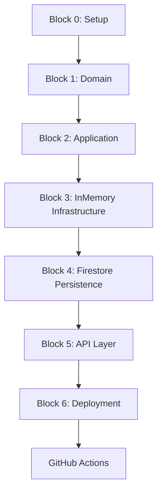

# Tasks: Headless Financial API

**Input**: Design documents from `/specs/001-headless-financial-api/`
**Prerequisites**: plan.md ✓, spec.md ✓, data-model.md ✓, contracts/openapi.yaml ✓

**Tooling**: Bun for installs and scripts (`bun install`, `bun test`)
**Testing**: Bun test runner (`bun:test`) with provider-agnostic tests (InMemory first, then Firestore)

---

## Block Structure Overview

This task list is organized into **implementation blocks** that build progressively:

| Block | Focus | Validation |
|-------|-------|------------|
| **Block 1** | Domain entities & core business logic | `bun test:unit` |
| **Block 2** | Application layer (commands, queries, handlers) | `bun test:unit` |
| **Block 3** | Infrastructure interfaces + InMemory providers | `bun test:integration` |
| **Block 4** | Firestore persistence implementations | `bun test:integration` |
| **Block 5** | API layer (Express routes, middleware) | `bun test:contract` |
| **Block 6** | Deployment to dev/stg | `bun test` (full suite) |

**⚠️ CHECKPOINT PROTOCOL**: After completing each block, run the specified test command. Only proceed to the next block after confirmation.

---

## Block 0: Project Setup

**Purpose**: Initialize project structure, dependencies, and tooling

- [x] T001 Create project directory structure per plan.md (`src/domain/`, `src/application/`, `src/infrastructure/`, `src/api/`, `src/functions/`, `src/config/`)
- [x] T002 Initialize Bun project with `bun init` and configure `package.json` scripts
- [x] T003 [P] Install core dependencies: TypeScript 5.x, Express, uuid
- [x] T004 [P] Configure `tsconfig.json` with strict mode enabled
- [x] T005 [P] Configure Bun test runner for TypeScript (`bun test` + `bun:test`)
- [x] T006 [P] Create `.env.example` with environment variable documentation
- [x] T007 [P] Setup ESLint and Prettier configuration
- [x] T008 Create `src/config/providers.ts` with provider selection stub (USE_INMEMORY env var)

**Validation**: `bun run typecheck` passes with no errors

---

## Block 1: Domain Layer (Entities & Business Logic)

**Purpose**: Pure business logic with no external dependencies. This is the heart of the system.

### 1.1 Domain Entities

**Goal**: Define all 8 entities from data-model.md with TypeScript interfaces, type guards, and factory functions.

- [x] T009 [P] Create `src/domain/entities/user.ts` - User interface, `createUser()`, `isUser()`, tier derivation
- [x] T010 [P] Create `src/domain/entities/score.ts` - Score interface, `createScore()`, ScoreChangeReason types
- [x] T011 [P] Create `src/domain/entities/card.ts` - Card interface, CardStatus enum, `createCard()`, state transitions
- [x] T012 [P] Create `src/domain/entities/card-request.ts` - CardRequest interface, CardRequestStatus enum, `createCardRequest()`
- [x] T013 [P] Create `src/domain/entities/transaction.ts` - Transaction interface (purchase/payment), `createTransaction()`
- [x] T014 [P] Create `src/domain/entities/event.ts` - OutboxEvent interface, EventType union, `createEvent()`
- [x] T015 [P] Create `src/domain/entities/audit-log.ts` - AuditLog interface, AuditAction types, `createAuditLog()`
- [x] T016 [P] Create `src/domain/entities/idempotency-record.ts` - IdempotencyRecord interface, `createIdempotencyRecord()`
- [x] T017 Create `src/domain/entities/index.ts` - Re-export all entities

### 1.2 Domain Services (Business Rules)

**Goal**: Implement pure business logic for scoring, card approval, and payment processing.

- [x] T018 Create `src/domain/services/scoring.ts` - Score calculation rules:
  - `calculatePaymentScoreImpact(amount, balance, isOnTime, daysOverdue)` → score delta
  - `deriveTier(score)` → 'high' | 'medium' | 'low'
  - `clampScore(score)` → bounded 0-1000
- [x] T019 Create `src/domain/services/card-approval.ts` - Approval logic:
  - `determineApprovalOutcome(score)` → { approved: boolean, limit: number, requiresReview: boolean }
  - `validateLimitForTier(limit, tier)` → boolean
  - `canRequestCard(user, existingCards, pendingRequests)` → { allowed: boolean, reason?: string }
- [x] T020 Create `src/domain/services/payment.ts` - Payment validation:
  - `validatePurchase(amount, availableCredit, cardStatus)` → { valid: boolean, error?: string }
  - `validatePayment(amount, balance)` → { valid: boolean, error?: string }
  - `calculateNewBalance(currentBalance, amount, type)` → number
- [x] T021 Create `src/domain/services/offers.ts` - Offer generation:
  - `generateOffers(user, existingCards, recentRejections)` → Offer[]
  - `getTermsForTier(tier)` → { limit: number, rate: string, features: string[] }

### 1.3 Domain Events

**Goal**: Define domain event types for the outbox pattern.

- [x] T022 Create `src/domain/events/types.ts` - Event payload types:
  - `UserCreatedPayload`, `ScoreChangedPayload`, `CardRequestedPayload`
  - `CardApprovedPayload`, `CardRejectedPayload`, `TransactionPayload`
- [x] T023 Create `src/domain/events/factory.ts` - Event factory functions:
  - `createUserCreatedEvent(user)` → OutboxEvent
  - `createScoreChangedEvent(userId, oldScore, newScore, reason)` → OutboxEvent
  - `createCardApprovedEvent(card, decision)` → OutboxEvent
  - etc.

### 1.4 Unit Tests for Domain

**Goal**: Test all business logic with no I/O dependencies.

- [x] T024 [P] Create `tests/unit/domain/entities/user.test.ts` - User entity tests (creation, tier derivation, validation)
- [x] T025 [P] Create `tests/unit/domain/entities/card.test.ts` - Card entity tests (state transitions, validation)
- [x] T026 [P] Create `tests/unit/domain/entities/card-request.test.ts` - CardRequest entity tests
- [x] T027 [P] Create `tests/unit/domain/services/scoring.test.ts` - Scoring service tests:
  - On-time minimum payment → +10 points
  - On-time full payment → +50 points
  - Late payment (1-7 days) → -20 points
  - Late payment (8-30 days) → -50 points
  - Late payment (30+ days) → -100 points
  - Score clamping at 0 and 1000
  - Tier boundary tests (499→low, 500→medium, 699→medium, 700→high)
- [x] T028 [P] Create `tests/unit/domain/services/card-approval.test.ts` - Approval tests:
  - High score (≥700) → auto-approve, $10,000 limit
  - Medium score (500-699) → auto-approve, $5,000 limit
  - Low score (<500) → pending, requires review
  - User with existing card → reject
  - User with pending request → reject
- [x] T029 [P] Create `tests/unit/domain/services/payment.test.ts` - Payment validation tests:
  - Purchase within credit → allowed
  - Purchase exceeding credit → rejected
  - Payment within balance → allowed
  - Payment exceeding balance → rejected
  - Purchase on suspended card → rejected
- [x] T030 [P] Create `tests/unit/domain/services/offers.test.ts` - Offer generation tests

---

### 🛑 CHECKPOINT: Block 1 Complete

```bash
bun test:unit
```

**Expected**: All domain entity and service tests pass. Zero external dependencies tested.

**Ask**: Ready to proceed to Block 2 (Application Layer)?

---

## Block 2: Application Layer (Commands, Queries, Handlers)

**Purpose**: Orchestration layer that coordinates domain logic with infrastructure (via interfaces).

### 2.1 Commands (Write Operations)

**Goal**: Define command objects for all write operations.

- [x] T031 [P] Create `src/application/commands/request-card.ts` - RequestCardCommand with idempotencyKey
- [x] T032 [P] Create `src/application/commands/make-purchase.ts` - MakePurchaseCommand with amount, merchant
- [x] T033 [P] Create `src/application/commands/make-payment.ts` - MakePaymentCommand with amount
- [x] T034 [P] Create `src/application/commands/admin-approve-card.ts` - AdminApproveCardCommand with limit, reason
- [x] T035 [P] Create `src/application/commands/admin-reject-card.ts` - AdminRejectCardCommand with reason
- [x] T036 [P] Create `src/application/commands/admin-adjust-score.ts` - AdminAdjustScoreCommand with newScore, reason
- [x] T037 [P] Create `src/application/commands/system-cleanup.ts` - SystemCleanupCommand with confirmationToken
- [x] T038 Create `src/application/commands/index.ts` - Re-export all commands

### 2.2 Queries (Read Operations)

**Goal**: Define query objects for all read operations.

- [x] T039 [P] Create `src/application/queries/get-dashboard.ts` - GetDashboardQuery
- [x] T040 [P] Create `src/application/queries/get-offers.ts` - GetOffersQuery
- [x] T041 [P] Create `src/application/queries/list-cards.ts` - ListCardsQuery with optional type filter
- [x] T042 [P] Create `src/application/queries/get-card.ts` - GetCardQuery
- [x] T043 [P] Create `src/application/queries/list-transactions.ts` - ListTransactionsQuery with pagination
- [x] T044 [P] Create `src/application/queries/admin-get-user-score.ts` - AdminGetUserScoreQuery
- [x] T045 [P] Create `src/application/queries/admin-list-pending-requests.ts` - AdminListPendingRequestsQuery with sort, pagination
- [x] T046 Create `src/application/queries/index.ts` - Re-export all queries

### 2.3 Command Handlers

**Goal**: Implement handlers that orchestrate domain services with repository interfaces.

- [x] T047 Create `src/application/handlers/request-card.handler.ts` - RequestCardHandler:
  - Validate idempotency key
  - Check user eligibility (no existing card, no pending request, cooldown)
  - Determine approval outcome based on score
  - Create card or pending request
  - Queue domain event
- [x] T048 Create `src/application/handlers/make-purchase.handler.ts` - MakePurchaseHandler:
  - Validate idempotency key
  - Validate card status and available credit
  - Create transaction, update balance
  - Queue domain event
- [x] T049 Create `src/application/handlers/make-payment.handler.ts` - MakePaymentHandler:
  - Validate idempotency key
  - Validate payment amount against balance
  - Determine on-time vs late status
  - Calculate score impact
  - Update balance, score, and card summary
  - Queue domain event
- [x] T050 Create `src/application/handlers/admin-approve-card.handler.ts` - AdminApproveCardHandler:
  - Validate request is pending
  - Validate limit within tier policy
  - Create card, update request status
  - Create audit log
  - Queue domain event
- [x] T051 Create `src/application/handlers/admin-reject-card.handler.ts` - AdminRejectCardHandler:
  - Validate request is pending
  - Update request status with reason
  - Create audit log
  - Queue domain event
- [x] T052 Create `src/application/handlers/admin-adjust-score.handler.ts` - AdminAdjustScoreHandler:
  - Validate score range (0-1000)
  - Update score, create score history
  - Update user tier
  - Create audit log
  - Queue domain event
- [x] T053 Create `src/application/handlers/system-cleanup.handler.ts` - SystemCleanupHandler:
  - Validate confirmation token
  - Delete all data in batches
  - Clear outbox
  - Queue cleanup event

### 2.4 Query Handlers

**Goal**: Implement handlers for read operations.

- [x] T054 Create `src/application/handlers/get-dashboard.handler.ts` - GetDashboardHandler:
  - Fetch user with denormalized cardSummary
  - Include active cards, pending requests
  - Return with ETag for caching
- [x] T055 Create `src/application/handlers/get-offers.handler.ts` - GetOffersHandler:
  - Check existing cards and recent rejections
  - Generate personalized offers based on tier
- [x] T056 Create `src/application/handlers/list-cards.handler.ts` - ListCardsHandler:
  - Fetch cards with optional type filter
  - Add near_limit warning flag for >90% utilization
- [x] T057 Create `src/application/handlers/admin-get-user-score.handler.ts` - AdminGetUserScoreHandler:
  - Fetch user score with last 10 changes
- [x] T058 Create `src/application/handlers/admin-list-pending-requests.handler.ts` - AdminListPendingRequestsHandler:
  - Fetch pending requests with pagination
  - Include user info, score at request, current score, days pending
  - Flag requests older than 7 days

### 2.5 Unit Tests for Application Layer

- [x] T059 [P] Create `tests/unit/application/handlers/request-card.handler.test.ts` - Test all approval paths
- [x] T060 [P] Create `tests/unit/application/handlers/make-purchase.handler.test.ts` - Test purchase validation
- [x] T061 [P] Create `tests/unit/application/handlers/make-payment.handler.test.ts` - Test payment & score impact
- [x] T062 [P] Create `tests/unit/application/handlers/admin-handlers.test.ts` - Test admin operations

---

### 🛑 CHECKPOINT: Block 2 Complete

```bash
bun test:unit
```

**Expected**: All domain and application unit tests pass. Handlers tested with mock interfaces.

**Ask**: Ready to proceed to Block 3 (Infrastructure - InMemory)?

---

## Block 3: Infrastructure Layer (Interfaces + InMemory Providers)

**Purpose**: Define repository interfaces and implement InMemory versions for fast, isolated testing.

### 3.1 Repository Interfaces

**Goal**: Define contracts for all data access operations.

- [x] T063 Create `src/infrastructure/persistence/interfaces/user-repository.ts` - IUserRepository:
  - `findById(ecosystemId)` → User | null
  - `findByFirebaseUid(uid)` → User | null
  - `save(user)` → void
  - `updateScore(ecosystemId, score, reason, source)` → void
  - `delete(ecosystemId)` → void
- [x] T064 Create `src/infrastructure/persistence/interfaces/card-repository.ts` - ICardRepository:
  - `findById(ecosystemId, cardId)` → Card | null
  - `findByUser(ecosystemId, filter?)` → Card[]
  - `save(ecosystemId, card)` → void
  - `updateBalance(ecosystemId, cardId, newBalance, version)` → void (optimistic lock)
  - `delete(ecosystemId, cardId)` → void
- [x] T065 Create `src/infrastructure/persistence/interfaces/card-request-repository.ts` - ICardRequestRepository:
  - `findById(ecosystemId, requestId)` → CardRequest | null
  - `findPendingByUser(ecosystemId)` → CardRequest | null
  - `findAllPending(sort, pagination)` → { requests: CardRequest[], cursor: string }
  - `save(ecosystemId, request)` → void
  - `updateStatus(ecosystemId, requestId, status, decision)` → void
- [x] T066 Create `src/infrastructure/persistence/interfaces/transaction-repository.ts` - ITransactionRepository:
  - `findByCard(ecosystemId, cardId, pagination)` → Transaction[]
  - `save(ecosystemId, cardId, transaction)` → void
- [x] T067 Create `src/infrastructure/persistence/interfaces/idempotency-repository.ts` - IIdempotencyRepository:
  - `find(ecosystemId, keyHash)` → IdempotencyRecord | null
  - `save(ecosystemId, record)` → void
  - `deleteExpired()` → number
- [x] T068 Create `src/infrastructure/persistence/interfaces/outbox-repository.ts` - IOutboxRepository:
  - `save(event)` → void
  - `findPending(limit)` → OutboxEvent[]
  - `markSent(eventId)` → void
  - `markFailed(eventId, error)` → void
  - `clear()` → void
- [x] T069 Create `src/infrastructure/persistence/interfaces/audit-log-repository.ts` - IAuditLogRepository:
  - `save(log)` → void
  - `findByTarget(targetType, targetId, pagination)` → AuditLog[]
- [x] T070 Create `src/infrastructure/persistence/interfaces/index.ts` - Re-export all interfaces

### 3.2 InMemory Implementations

**Goal**: Implement all repositories using in-memory Maps for fast testing.

- [x] T071 Create `src/infrastructure/persistence/inmemory/user-repository.ts` - InMemoryUserRepository
- [x] T072 Create `src/infrastructure/persistence/inmemory/card-repository.ts` - InMemoryCardRepository (with optimistic locking)
- [x] T073 Create `src/infrastructure/persistence/inmemory/card-request-repository.ts` - InMemoryCardRequestRepository
- [x] T074 Create `src/infrastructure/persistence/inmemory/transaction-repository.ts` - InMemoryTransactionRepository
- [x] T075 Create `src/infrastructure/persistence/inmemory/idempotency-repository.ts` - InMemoryIdempotencyRepository
- [x] T076 Create `src/infrastructure/persistence/inmemory/outbox-repository.ts` - InMemoryOutboxRepository
- [x] T077 Create `src/infrastructure/persistence/inmemory/audit-log-repository.ts` - InMemoryAuditLogRepository
- [x] T078 Create `src/infrastructure/persistence/inmemory/index.ts` - Re-export all InMemory implementations

### 3.3 Auth Provider Interface + Mock

- [x] T079 Create `src/infrastructure/auth/interfaces/auth-provider.ts` - IAuthProvider:
  - `verifyToken(token)` → { uid: string, email: string, isAdmin: boolean } | null
  - `getUserStatus(uid)` → 'active' | 'disabled' | null
- [x] T080 Create `src/infrastructure/auth/mock/auth-provider.ts` - MockAuthProvider for testing

### 3.4 Event Publisher Interface + InMemory

- [x] T081 Create `src/infrastructure/events/event-publisher.interface.ts` - IEventPublisher:
  - `publish(event)` → void
- [x] T082 Create `src/infrastructure/events/inmemory-event-publisher.ts` - InMemoryEventPublisher (stores in array)

### 3.5 Dependency Injection Container

- [x] T083 Create `src/infrastructure/di/container.ts` - DI container with provider registration:
  - Register all repository interfaces
  - Register auth provider
  - Register event publisher
  - `createTestContainer()`, `createProductionContainer()`, `createEmulatorContainer()` factories

### 3.6 Integration Tests (InMemory)

**Goal**: Test complete user journeys using InMemory providers.

- [x] T084 Create `tests/integration/infrastructure/container.test.ts` - DI Container and Repository integration tests
- [x] T085 Create `tests/integration/card-request-approval.test.ts` - Card request → auto-approval flow:
  - High score user → immediate approval
  - Medium score user → immediate approval
  - Low score user → pending
- [x] T086 Create `tests/integration/card-request-admin.test.ts` - Admin approval/rejection flow
- [x] T087 Create `tests/integration/purchase-payment.test.ts` - Purchase → payment → score update flow:
  - Purchase reduces available credit
  - On-time payment increases score
  - Late payment decreases score
- [x] T088 Create `tests/integration/idempotency.test.ts` - Idempotency key handling:
  - Duplicate request returns same response
  - Different key creates new operation
- [x] T089 Create `tests/integration/concurrency.test.ts` - Optimistic locking tests:
  - Concurrent balance updates → one succeeds, one fails

---

### 🛑 CHECKPOINT: Block 3 Complete

```bash
bun test:integration
```

**Expected**: All integration tests pass using InMemory providers. Complete user journeys work.

**Ask**: Ready to proceed to Block 4 (Firestore Persistence)?

---

## Block 4: Firestore Persistence Implementations

**Purpose**: Implement production-ready Firestore repositories that match InMemory behavior.

### 4.1 Firestore Setup

- [x] T090 Install Firebase Admin SDK: `bun add firebase-admin`
- [x] T091 Create `src/infrastructure/persistence/firestore/client.ts` - Firestore initialization
- [x] T092 Create `firebase.json` with emulator configuration (ports: 8080, 9099, 5001)
- [x] T093 Create `firestore.rules` with security rules per data-model.md
- [x] T094 Create `firestore.indexes.json` with required composite indexes

### 4.2 Firestore Repository Implementations

**Goal**: Implement all repositories using Firestore SDK. Must pass same integration tests as InMemory.

- [x] T095 Create `src/infrastructure/persistence/firestore/user.repository.ts` - FirestoreUserRepository:
  - Hierarchical path: `users/{ecosystemId}`
  - Denormalized cardSummary updates
- [x] T096 Create `src/infrastructure/persistence/firestore/card.repository.ts` - FirestoreCardRepository:
  - Path: `users/{ecosystemId}/cards/{cardId}`
  - Pessimistic locking via transactions
  - Version field for optimistic concurrency
- [x] T097 Create `src/infrastructure/persistence/firestore/card-request.repository.ts` - FirestoreCardRequestRepository:
  - Path: `users/{ecosystemId}/cardRequests/{requestId}`
  - Index on status + createdAt for admin queries
- [x] T098 Create `src/infrastructure/persistence/firestore/transaction.repository.ts` - FirestoreTransactionRepository:
  - Path: `users/{ecosystemId}/cards/{cardId}/transactions/{txId}`
- [x] T099 Create `src/infrastructure/persistence/firestore/idempotency.repository.ts` - FirestoreIdempotencyRepository:
  - Path: `users/{ecosystemId}/idempotencyKeys/{keyHash}`
  - TTL cleanup via scheduled function
- [x] T100 Create `src/infrastructure/persistence/firestore/outbox.repository.ts` - FirestoreOutboxRepository:
  - Root collection: `outbox/{eventId}`
  - Index on status + nextRetryAt
- [x] T101 Create `src/infrastructure/persistence/firestore/audit-log.repository.ts` - FirestoreAuditLogRepository:
  - Root collection: `auditLogs/{logId}`
- [x] T102 Create `src/infrastructure/persistence/firestore/index.ts` - Re-export all Firestore implementations

### 4.3 Firebase Auth Provider

- [x] T103 Create `src/infrastructure/auth/firebase-auth.provider.ts` - FirebaseAuthProvider:
  - Token verification via Admin SDK
  - Custom claim extraction for admin role
  - User status check

### 4.4 Provider Selection Update

- [x] T104 Update `src/infrastructure/di/container-factory.ts` - Add Firestore provider selection:
  - `createTestContainer()` → InMemory providers
  - `createProductionContainer()` → Firestore providers
  - `createEmulatorContainer()` → Firestore with emulator

### 4.5 Integration Tests with Firestore Emulator

- [x] T105 Create `docker-compose.yml` - Docker-based Firebase emulator setup
- [x] T106 Add emulator scripts to package.json:
  - `emulator:start` - Start Firebase emulators via Docker
  - `emulator:stop` - Stop emulators
  - `test:firestore` - Run tests against Firestore emulator

---

### 🛑 CHECKPOINT: Block 4 Complete

```bash
# InMemory tests
USE_INMEMORY=true bun test:integration

# Firestore emulator tests
firebase emulators:exec "USE_INMEMORY=false bun test:integration"
```

**Expected**: Same integration tests pass with both InMemory AND Firestore providers.

**Ask**: Ready to proceed to Block 5 (API Layer)?

---

## Block 5: API Layer (Express Routes + Middleware)

**Purpose**: HTTP layer exposing all functionality via RESTful endpoints per OpenAPI spec.

### 5.1 Express Setup

- [x] T107 Install Express and middleware: `bun add express cors helmet`
- [x] T108 Create `src/api/app.ts` - Express app setup with middleware chain
- [x] T109 Create `src/api/middleware/error-handler.ts` - Global error handling with request-id
- [x] T110 Create `src/api/middleware/request-id.ts` - Request ID injection (X-Request-ID header)
- [x] T111 Create `src/api/middleware/auth.ts` - Token validation middleware (Bearer token)
- [x] T112 Create `src/api/middleware/admin.ts` - Admin role check middleware
- [x] T113 Create `src/api/middleware/rate-limit.ts` - Rate limiting (10 auth/min, 100 API/min)

### 5.2 DTO Definitions

- [x] T114 [P] Create `src/api/dto/dashboard.dto.ts` - Dashboard response shape
- [x] T115 [P] Create `src/api/dto/offers.dto.ts` - Offers response shape
- [x] T116 [P] Create `src/api/dto/cards.dto.ts` - Card list/detail response shapes
- [x] T117 [P] Create `src/api/dto/transactions.dto.ts` - Transaction response shapes
- [x] T118 [P] Create `src/api/dto/admin.dto.ts` - Admin endpoint shapes
- [x] T119 [P] Create `src/api/dto/errors.dto.ts` - Error response shapes per OpenAPI spec

### 5.3 Route Implementations

**Goal**: Implement all endpoints from openapi.yaml

- [x] T120 Create `src/api/routes/health.ts` - Health endpoints:
  - `GET /health/liveness` - Basic alive check
  - `GET /health/readiness` - Dependency health check
- [x] T121 Create `src/api/routes/dashboard.ts` - Dashboard endpoint:
  - `GET /v1/dashboard` - User dashboard with ETag support
- [x] T122 Create `src/api/routes/offers.ts` - Offers endpoint:
  - `GET /v1/offers` - Personalized product offers
- [x] T123 Create `src/api/routes/cards.ts` - Card endpoints:
  - `GET /v1/cards` - List cards (with type filter)
  - `POST /v1/cards/requests` - Request new card
  - `GET /v1/cards/requests/{requestId}` - Get request status
  - `GET /v1/cards/{cardId}` - Get card details
- [x] T124 Create `src/api/routes/transactions.ts` - Transaction endpoints:
  - `POST /v1/cards/{cardId}/purchases` - Simulate purchase
  - `POST /v1/cards/{cardId}/payments` - Make payment
  - `GET /v1/cards/{cardId}/transactions` - List transactions
- [x] T125 Create `src/api/routes/admin.ts` - Admin endpoints:
  - `GET /v1/admin/users/{ecosystemId}/score` - Get user score
  - `PUT /v1/admin/users/{ecosystemId}/score` - Adjust score
  - `GET /v1/admin/card-requests` - List pending requests
  - `POST /v1/admin/card-requests/{requestId}/approve` - Approve request
  - `POST /v1/admin/card-requests/{requestId}/reject` - Reject request
  - `POST /v1/admin/cleanup` - System reset
- [x] T126 Create `src/api/routes/index.ts` - Route aggregation

### 5.4 Firebase Functions Entry Point

- [x] T127 Create `src/functions/http.ts` - HTTP trigger wrapping Express app
- [x] T128 Create `src/functions/pubsub.ts` - Pub/Sub trigger for outbox processing
- [x] T129 Create `src/functions/scheduled.ts` - Scheduled functions:
  - Outbox processor (every 1 minute)
  - Idempotency key cleanup (daily)

### 5.5 Contract Tests

**Goal**: Validate API matches OpenAPI specification

- [x] T130 [P] Create `tests/contract/health.test.ts` - Health endpoint contract tests
- [x] T131 [P] Create `tests/contract/dashboard.test.ts` - Dashboard endpoint contract tests
- [x] T132 [P] Create `tests/contract/offers.test.ts` - Offers endpoint contract tests
- [x] T133 [P] Create `tests/contract/cards.test.ts` - Cards endpoint contract tests
- [x] T134 [P] Create `tests/contract/transactions.test.ts` - Transaction endpoint contract tests
- [x] T135 [P] Create `tests/contract/admin.test.ts` - Admin endpoint contract tests
- [x] T136 Create `tests/contract/errors.test.ts` - Error response contract tests (401, 403, 404, 409, etc.)

---

### 🛑 CHECKPOINT: Block 5 Complete

```bash
# All test levels
bun test:unit
bun test:integration
bun test:contract
```

**Expected**: All tests pass. API matches OpenAPI spec. Full system functional locally.

**Ask**: Ready to proceed to Block 6 (Deployment)?

---

## Block 6: Deployment to Dev/Staging

**Purpose**: Deploy to GCP Firebase Functions with CI/CD pipeline.

### 6.1 Firebase Configuration

- [ ] T137 Create `firebase.json` with functions configuration
- [ ] T138 Update `package.json` with Firebase Functions entry point
- [x] T139 Create `.env.production` template with production variables (see `.env.production.example`)
- [ ] T140 Create `src/config/telemetry.ts` - OpenTelemetry setup for Cloud Trace (deferred to Spec 003; non-blocking for Spec 001)

### 6.2 Build and Deploy Scripts

- [x] T141 Create build script in `package.json` - TypeScript compilation
- [ ] T142 Create `deploy:dev` script - Deploy to development project
- [ ] T143 Create `deploy:stg` script - Deploy to staging project

### 6.3 Manual Deployment Test

- [ ] T144 Deploy to dev environment: `bun run deploy:dev`
- [ ] T145 Run smoke tests against deployed API
- [ ] T146 Verify health endpoints work
- [ ] T147 Test authentication flow with real Firebase Auth

---

### 🛑 CHECKPOINT: Block 6 Complete

```bash
# Full test suite
bun test

# Deploy to dev
bun run deploy:dev
```

**Expected**: Application deployed and functional in dev environment.

---

## 🔜 Next: GitHub Actions Workflows

After Block 6 is complete, the next step is to configure GitHub Actions for CI/CD:

1. **Test workflow** - Run on PR (lint, typecheck, test:unit, test:integration)
2. **Deploy workflow** - Deploy to dev on merge to main
3. **Production workflow** - Deploy to prod with manual approval

**Prompt**: Please configure me with the appropriate GitHub Actions workflows and secrets!

---

## Dependencies Summary



## Task Count Summary

| Block | Tasks | Focus |
|-------|-------|-------|
| Block 0 | 8 | Setup |
| Block 1 | 22 | Domain |
| Block 2 | 24 | Application |
| Block 3 | 27 | Infrastructure (InMemory) |
| Block 4 | 17 | Persistence (Firestore) |
| Block 5 | 30 | API |
| Block 6 | 11 | Deployment |
| **Total** | **139** | |

---

## Notes

- `[P]` tasks within a block can run in parallel
- Each block should be completed and validated before starting the next
- InMemory providers enable fast TDD cycles without emulator overhead
- Same integration tests validate both InMemory and Firestore implementations
- Contract tests ensure API matches OpenAPI specification

---

## Extra Tasks (Appended - 2026-01-04)

**Discussed by Taz and Codex at 2026-01-04 13:27:19 -03.**
**Note**: Task Count Summary above does not include these appended tasks.

- [x] T148 [P] Update routes to use plural card request paths:
  - `POST /v1/cards/requests`
  - `GET /v1/cards/requests/{requestId}`
  - **STATUS**: COMPLETE - Routes updated in `src/api/routes/cards.ts` and console logs in `src/functions/http.ts`.

- [x] T149 [P] Align contract tests and route docs with plural card request paths.
  - **STATUS**: COMPLETE - Contract tests updated in `tests/contract/cards.test.ts` and `tests/contract/errors.test.ts`.

- [ ] T150 Define M2M auth boundary:
  - Service-account authentication for machine calls
  - Optional origination context header for user token/grants
  - **STATUS**: DEFERRED - Future hardening phase. Current auth supports user JWT + admin roles.

- [ ] T151 Update outbox processing cadence to 5–10 seconds and document timing guarantees.
  - **STATUS**: DEFERRED - Current scheduled function runs every 1 minute. Fine-tuning for production.

- [x] T152 Defer rate-limiting implementation to the final hardening phase
  (after core flows and tests are green).
  - **STATUS**: ACKNOWLEDGED - Rate limiting middleware exists as stub. Full implementation deferred.

- [x] T153 Document the Cards API vs future BFF boundary (login UX + Customer360).
  - **STATUS**: COMPLETE - Documented in `spec.md` scope guardrails and `plan.md` patch sections.

---

## Scope Note (Appended - 2026-01-04)

**Discussed by Taz and Codex at 2026-01-04 20:46:01 -0300.**

This task list is for **Spec 001** only. The following topics are intentionally
deferred to a future spec (`003-streaming-and-observability`) and should not
block completion of Spec 001:
- BigQuery streaming / Customer360 analytics
- Redpanda provisioning and forwarding domain events
- OpenTelemetry instrumentation and Grafana LGTM (or Datadog) exploration

---

## Implementation Quality Notes (2026-01-04)

### Completed Improvements

1. **Application Handler Unit Tests (T059-T062)** - Created comprehensive unit tests for:
   - `request-card.handler.test.ts` - Tests all approval paths, eligibility, idempotency
   - `make-purchase.handler.test.ts` - Tests purchase validation, credit limits, card status
   - `make-payment.handler.test.ts` - Tests on-time/late payments, score impact, clamping
   - `admin-handlers.test.ts` - Tests approve, reject, and score adjustment handlers

2. **Makefile** - Created `Makefile` with validation commands:
   - `make validate` - Full validation pipeline
   - `make test-unit`, `make test-integration`, `make test-contract`
   - `make emulator-start`, `make test-firestore`

3. **OpenAPI drift fix** - Updated `contracts/openapi.yaml` to match implemented routes:
   - Card requests: `POST /v1/cards/requests` and `GET /v1/cards/requests/{requestId}`
   - Transactions: `POST /v1/cards/{cardId}/transactions/purchases|payments`

4. **CI workflow** - Added `.github/workflows/00-ci.yml` (Bun-first validation on PR/push).

### Future Improvements (Noted for Hardening Phase)

1. **Structured Logging** - Current implementation uses console.log/error for development.
   - Consider adding pino or winston for production structured logging
   - Add correlation IDs and request context to all log entries

2. **Rate Limiting** - Middleware stub exists but not fully implemented (T152)

3. **Input Validation** - Manual validation in routes works but could benefit from zod/joi

4. **Score History Repository** - Score changes tracked via user repository; separate
   score history tracking could enhance audit capabilities

---

## Block 7: Feature Flags / Dynamic Configuration (Appended - 2026-01-05)

**Purpose**: Add dynamic configuration capability via Firebase Remote Config to change function behavior without redeployment.

### 7.1 Remote Config Infrastructure

- [ ] T154 Create `src/infrastructure/config/remote-config.types.ts` - Configuration parameter types:
  - `limits.low_tier` (number, default: 500)
  - `limits.medium_tier` (number, default: 1500)
  - `limits.high_tier` (number, default: 3000)
  - `approval.auto_approve_threshold` (number, default: 700)
  - `whatsapp.notifications_enabled` (boolean, default: true)
  - `whatsapp.approval_expiry_hours` (number, default: 24)
  - `scoring.payment_bonus_max` (number, default: 50)
  - `scoring.late_penalty_severe` (number, default: 100)

- [ ] T155 [P] Create `src/infrastructure/config/remote-config.defaults.ts` - Fallback defaults:
  - Define all default values for offline/error scenarios
  - Export `DEFAULT_CONFIG` constant

- [ ] T156 Create `src/infrastructure/config/remote-config.service.ts` - RemoteConfigService:
  - `initialize()` - Fetch and cache configuration
  - `getLimits()` - Return tier-based credit limits
  - `getApprovalThreshold()` - Return auto-approval score threshold
  - `isWhatsAppEnabled()` - Return notification toggle
  - `getScoringParams()` - Return scoring parameters
  - Type-safe getters with fallback to defaults

### 7.2 Service Integrations

- [ ] T157 Integrate RemoteConfig into `src/domain/services/card-approval.service.ts`:
  - Use dynamic limits instead of hardcoded values
  - Use dynamic auto-approve threshold

- [ ] T158 [P] Integrate RemoteConfig into `src/domain/services/scoring.service.ts`:
  - Use dynamic scoring parameters for bonuses/penalties

- [ ] T159 [P] Integrate RemoteConfig into `src/application/handlers/whatsapp-approval.handler.ts`:
  - Use dynamic limits for card approval
  - Check dynamic notification toggle

### 7.3 Testing

- [ ] T160 [P] Create `tests/unit/infrastructure/config/remote-config.service.test.ts`:
  - Test initialization and caching
  - Test fallback to defaults on error
  - Test type-safe getters
  - Test configuration refresh

- [ ] T161 Add Remote Config setup documentation to README

### Integration Notes

- Firebase Remote Config SDK: `firebase-admin` (already installed)
- Cache fetch interval: 5 minutes in production, 0 in development
- All services should gracefully fallback to defaults if Remote Config unavailable
